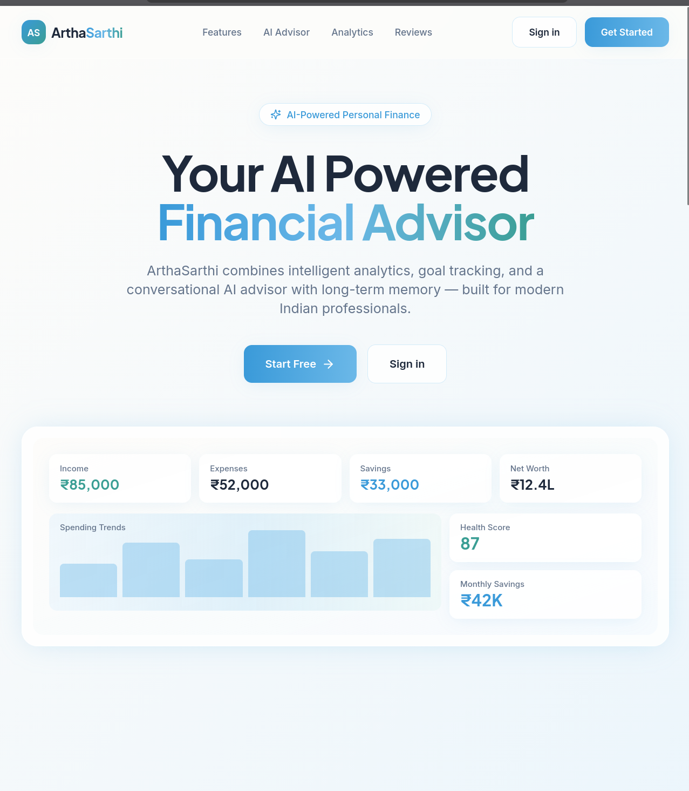
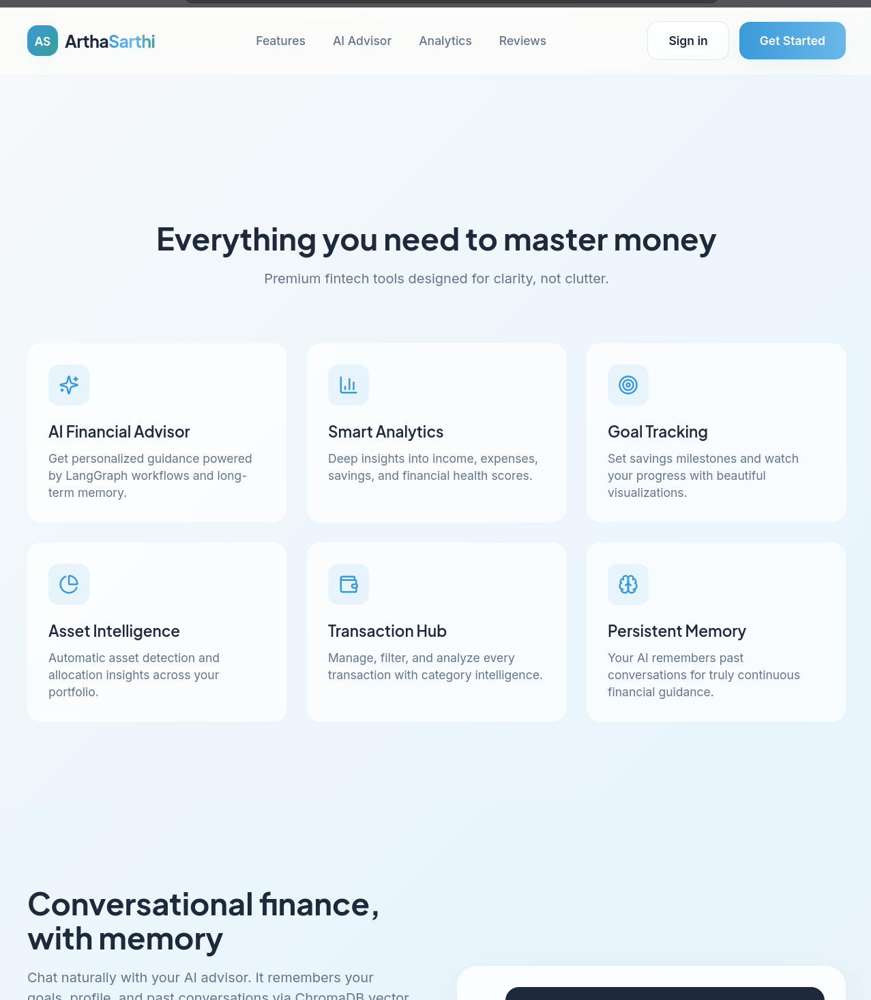
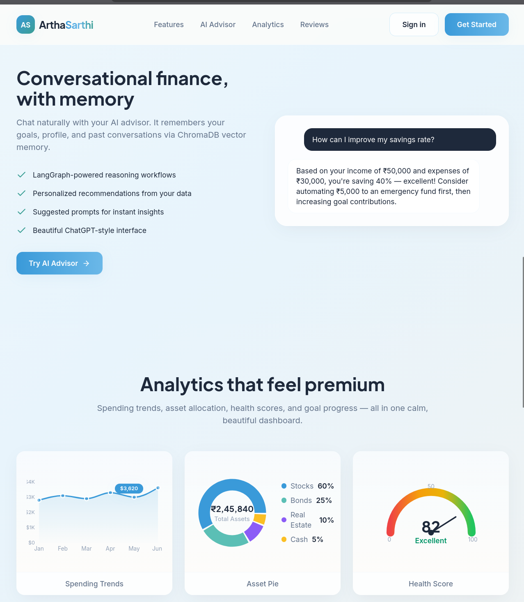
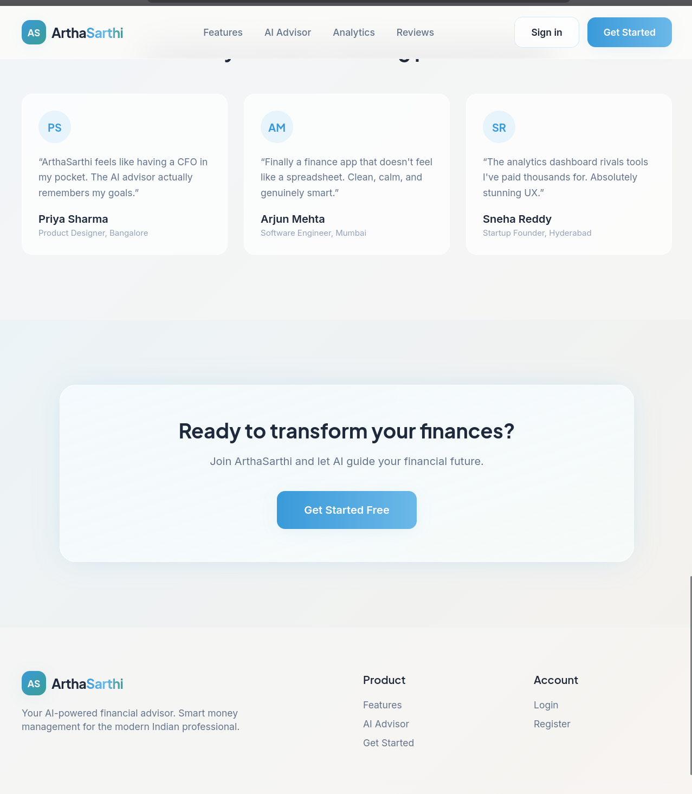
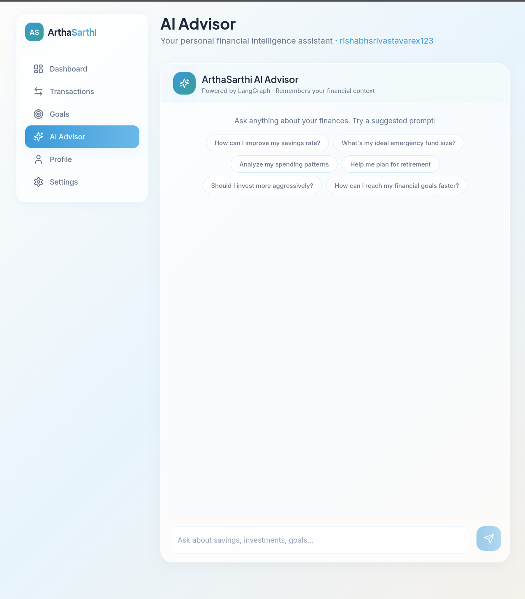
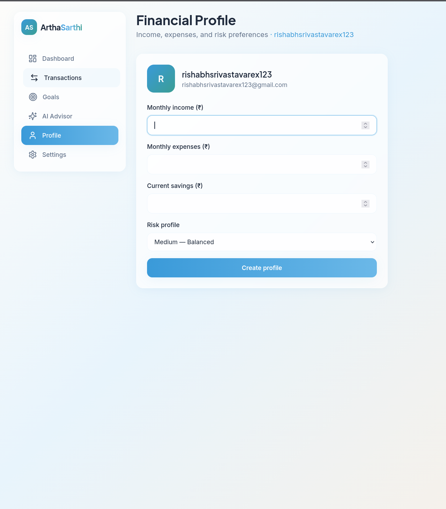

# ArthaSarthi – AI-Powered Personal Finance Intelligence Platform

## Live Demo

The frontend is deployed on Vercel: [ArthaSarthi Live Demo](https://frontend-rishabh1308s-projects.vercel.app)

## Overview

ArthaSarthi is a full-stack AI-powered personal finance intelligence platform designed to help users manage transactions, analyze financial health, track goals, detect asset allocations, and receive AI-generated financial guidance.

The system combines:

* A scalable Spring Boot backend
* A FastAPI-based AI engine
* JWT authentication and secure APIs
* Financial analytics and portfolio intelligence
* AI-driven advisory workflows
* Dockerized microservice architecture

The platform is designed with production-style backend engineering principles including layered architecture, structured logging, centralized exception handling, RESTful APIs, Docker orchestration, Swagger/OpenAPI documentation, and modular service design.

---

## Screenshots

| Landing page | Features |
| --- | --- |
|  |  |
| AI advisor and analytics | Testimonials and call to action |
|  |  |
| AI Advisor | Financial Profile |
|  |  |

---

# Core Features

## Authentication & Security

* JWT-based authentication
* User registration and login
* Password encryption using BCrypt
* Stateless authentication flow
* Protected API architecture
* Spring Security integration

---

## Transaction Management

Users can:

* Create financial transactions
* Categorize transactions
* Track income and expenses
* Maintain transaction history
* Analyze spending behavior

Supported transaction types:

* CREDIT
* DEBIT

Examples:

* Salary
* Rent
* Food
* Investments
* Crypto purchases
* Gold ETF investments

---

## Financial Analysis Engine

The backend performs automated financial analysis using user transactions.

### Analysis includes:

* Total income calculation
* Total expense calculation
* Savings computation
* Expense-to-income ratio
* Financial risk profiling

### Risk Profiles

* LOW
* MEDIUM
* HIGH

The analysis engine also maintains historical financial profiles for tracking changes over time.

---

## Asset Detection & Portfolio Intelligence

The platform automatically detects user asset classes from transaction metadata.

### Supported asset categories:

* Stocks
* Mutual Funds
* Crypto
* Gold
* Silver
* Real Estate
* Debt Instruments

The asset engine uses keyword-based classification to infer portfolio composition and diversification.

---

## Goal Management System

Users can create and manage financial goals.

### Goal Features

* Goal creation
* Goal prioritization
* Target amount tracking
* Current amount tracking
* Time horizon tracking
* Goal status monitoring

Examples:

* Emergency Fund
* Retirement Planning
* House Purchase
* Investment Corpus
* Higher Education

---

## AI Financial Advisor

ArthaSarthi integrates a FastAPI-based AI engine that generates contextual financial guidance.

The AI advisory system uses:

* Financial profile data
* User goals
* Asset allocations
* Spending behavior
* Savings trends
* Portfolio diversification insights

### AI-generated outputs include:

* Financial health summaries
* Emergency fund recommendations
* Diversification guidance
* Liquidity analysis
* Goal-based planning
* Savings optimization
* Risk-aware investment suggestions

---

## Advice History Tracking

All AI-generated advice is stored for historical tracking.

The system maintains:

* Query history
* AI responses
* Generation timestamps
* Associated user profiles
* Advice generation source tracking

This creates long-term financial advisory memory for future analysis.

---

# System Architecture

## High-Level Architecture

```text
Frontend / API Client
        ↓
Spring Boot Backend
        ↓
AI Engine (FastAPI)
        ↓
OpenAI API

Spring Boot Backend
        ↓
MySQL Database

AI Engine
        ↓
ChromaDB Vector Storage
```

---

## Backend Architecture

The backend follows layered architecture principles.

```text
Controller Layer
        ↓
Service Layer
        ↓
Repository Layer
        ↓
Database
```

### Controller Layer

Handles:

* API routing
* Request validation
* Response formatting
* Swagger documentation

### Service Layer

Handles:

* Business logic
* Financial calculations
* AI integration
* Transaction workflows
* Goal workflows

### Repository Layer

Handles:

* Database access
* JPA operations
* Entity persistence

---

# Technology Stack

| Layer            | Technology      |
| ---------------- | --------------- |
| Backend          | Spring Boot     |
| AI Engine        | FastAPI         |
| Database         | MySQL           |
| ORM              | Spring Data JPA |
| Authentication   | JWT             |
| Security         | Spring Security |
| Documentation    | Swagger/OpenAPI |
| Containerization | Docker          |
| Orchestration    | Docker Compose  |
| Logging          | SLF4J + Logback |
| AI Integration   | OpenAI API      |
| Vector Storage   | ChromaDB        |
| Build Tool       | Maven           |

---

# REST APIs

## Authentication APIs

### Register User

```http
POST /auth/register
```

### Login User

```http
POST /auth/login
```

---

## Transaction APIs

### Add Transaction

```http
POST /users/{userId}/transactions
```

### Get User Transactions

```http
GET /users/{userId}/transactions
```

---

## Financial Analysis APIs

### Analyze Financial Profile

```http
GET /users/{userId}/analysis
```

---

## Asset APIs

### Get Asset Allocation

```http
GET /users/{userId}/assets
```

---

## Goal APIs

### Create Goal

```http
POST /users/{userId}/goals
```

### Get Goals

```http
GET /users/{userId}/goals
```

---

## AI Advice APIs

### Generate AI Advice

```http
POST /api/advice
```

### Get Advice History

```http
GET /api/advice/{userId}/history
```

---

## User Profile APIs

### Create Financial Profile

```http
POST /users/{userId}/profile
```

### Get Financial Profile

```http
GET /users/{userId}/profile
```

### Update Financial Profile

```http
PUT /users/{userId}/profile
```

---

# Swagger/OpenAPI Documentation

Swagger UI is integrated for interactive API exploration and testing.

### Swagger URL

```text
http://localhost:8080/swagger-ui/index.html
```

### OpenAPI JSON

```text
http://localhost:8080/v3/api-docs
```

Features include:

* Live API testing
* Request/response schemas
* JWT authentication support
* Grouped API documentation
* Interactive endpoint execution

---

# Dockerized Infrastructure

The entire platform is containerized using Docker.

## Services

### Backend Service

* Spring Boot API server
* Runs on port 8080

### AI Engine Service

* FastAPI AI service
* Runs on port 8001

### MySQL Service

* Persistent relational database
* Docker volume support

### ChromaDB Volume

* Persistent vector storage

---

# Local Development Setup

## Clone Repository

```bash
git clone <repository-url>
cd ArthaSarthi
```

---

## Configure Environment Variables

Create `.env`

```env
JWT_SECRET=your_secret_key
OPENAI_API_KEY=your_openai_api_key
```

---

## Start Entire System

```bash
docker compose up --build
```

---

## Access Services

| Service    | URL                                                                                        |
| ---------- | ------------------------------------------------------------------------------------------ |
| Backend    | [http://localhost:8080](http://localhost:8080)                                             |
| AI Engine  | [http://localhost:8001](http://localhost:8001)                                             |
| Swagger UI | [http://localhost:8080/swagger-ui/index.html](http://localhost:8080/swagger-ui/index.html) |

---

# Logging & Observability

The platform includes structured production-style logging.

### Features

* Request lifecycle logging
* Controller-level tracing
* Service-level business logs
* Error logging
* Request timing filters
* Structured API responses

Example log:

```text
POST /auth/login completed in 182 ms with status 200
```

---

# API Response Standardization

All APIs follow a consistent response structure.

Example:

```json
{
  "success": true,
  "message": "Transaction added successfully",
  "data": {
    "transactionId": 1
  },
  "timestamp": "2026-05-09T18:00:00"
}
```

---

# Security Features

* JWT authentication
* BCrypt password hashing
* Stateless authentication
* Protected endpoints
* Structured validation
* Layered architecture
* Request filtering

---

# Scalability Considerations

The system architecture is designed for extensibility and future scalability.

Potential future enhancements include:

* Retrieval-Augmented Generation (RAG)
* Personalized AI memory
* Portfolio optimization models
* ML-based risk prediction
* Kafka-based event streaming
* Redis caching
* Notification system
* Real-time analytics
* Multi-user financial collaboration
* Budget forecasting
* AI-powered anomaly detection

---

# Engineering Highlights

* Layered backend architecture
* Microservice-style AI separation
* Dockerized deployment
* Structured logging
* RESTful API design
